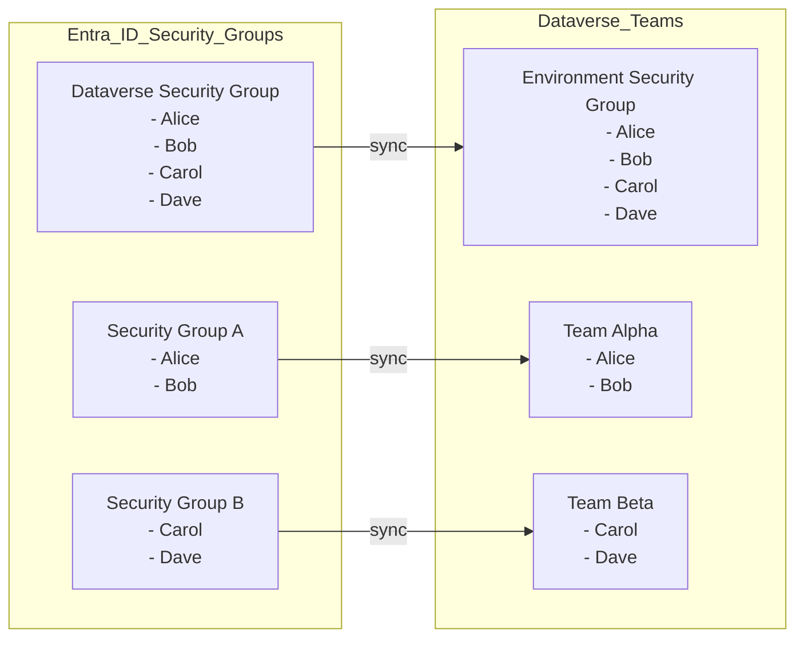

ForceSync is a lightweight solution to sync Users between Entra and Dataverse.

Initial Situation:
We want to use Entra ID Security Groups to sync their members to Dataverse teams. Users in Dataverse do not get any security roles directly assigned. Roles are only assigned to Dataverse Teams.

[Manual Trigger]
      |
      v
[Compose - environmentid]
      |
      v
[Get Environment as Admin]
      |
      v
[Get group members - environment security group]
      |
      v
[Select - group member id]
      |
      v
[List rows - all Entra Group synced teams]
      |
      v
+---------------------------+
| For each Entra security   |
| group (team)              |
+---------------------------+
      |
      v
[Get group members]
      |
      v
+---------------------------+
| For each group member     |
+---------------------------+
      |
      v
[Filter: Is Entra ID group member also member in environment security group?]
      |
      v
[Condition: Is member also in environment security group?]
      |                |
      |                v
      |           [Force Sync user to Dataverse]
      |
      v
[For each team member]
      |
      v
[Perform bound action - force sync of team members]