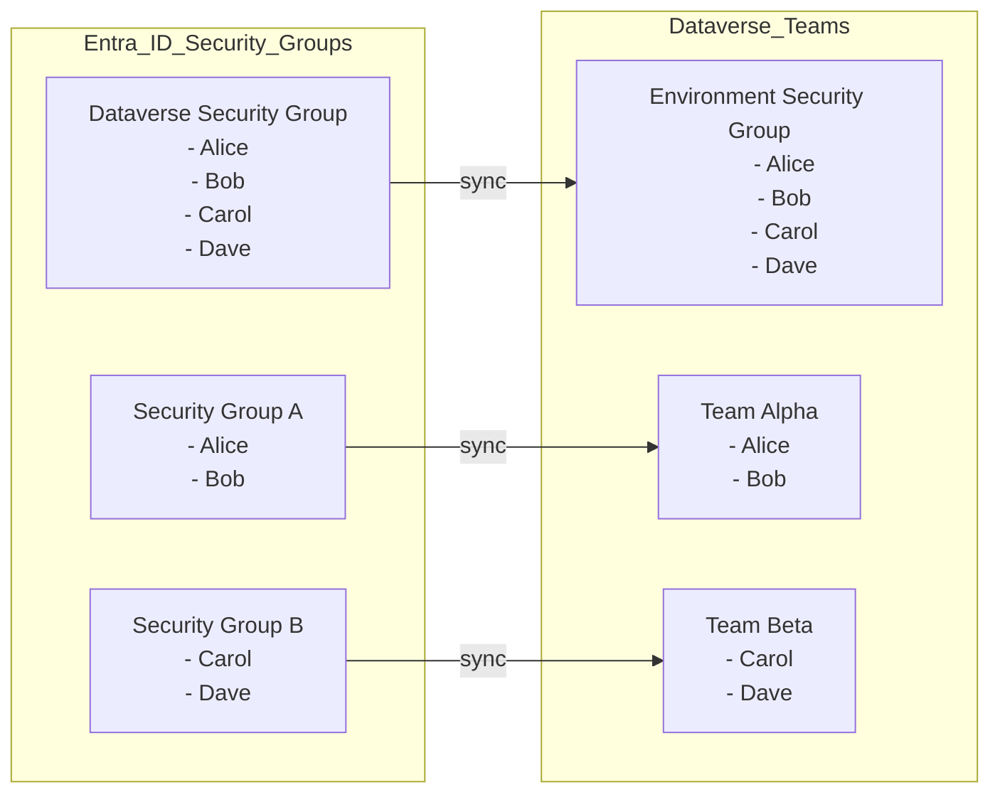
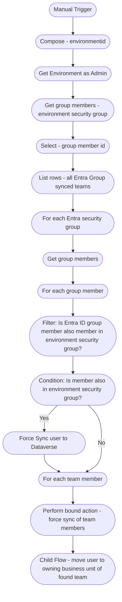
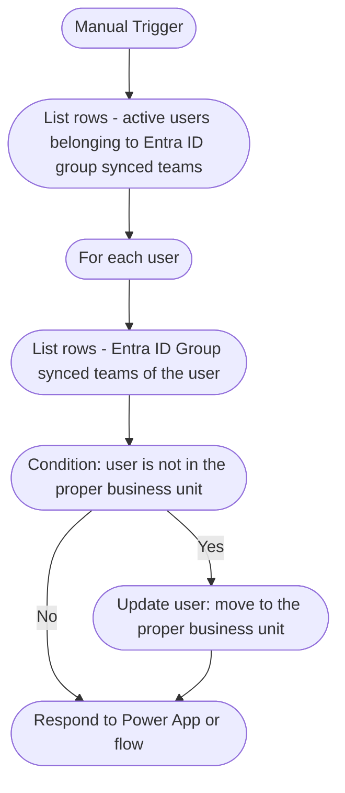

ForceSync is a lightweight solution to sync Users between Entra and Dataverse, sync the memberships of Entra ID security groups and linked Dataverse teams and move of users to the proper Business Unit in Dataverse.

# Initial Situation:  
We want to use Entra ID Security Groups to manage access control to Dataverse. Therefore Entzra ID Security Groups are linked to Dataverse teams. Users in Dataverse do not get any security roles directly assigned. Roles are only assigned to Dataverse Teams. Furthermore every user only belongs to synced Dataverse teams which belong to the same Business Unit in Dataverse. 

# Challenges:
1. Users are usually added in Dataverse when they are added to the Entra ID Security Group used as Environment Security Group and also have valid license to access Dataverse. However, I have experience a couple of times that this process didn't work in any case. Then I had to add the user manually to Dataverse.
2. When a user is added to an Entra ID Security Group which is linked to a Dataverse team the user is only added to the Dataverse team when he access Dataverse next time. This means the user already exists in Dataverse but he has no security roles as he does not yet belong to a synchronized team. As result you cannot assign data the user or create a Bookable resource for this user. Especially in preparation of an initial GoLive he barely can ask every user to access Dataverse so you can proceed with your preparation.
3. When the user is initially created in Dataverse he always belongs to the root Business Unit. Most of the time this is not sufficient and the user needs to be moved to the proper business unit. Based on data in Entra it is often not possible to determine which Business Unit the user should be assigned too.

# Solution:
We use Cloud Flows to 
- force the sync of users from Entra to Dataverse so the user is created in Dataverse
- force the sync of memberships in Entra ID Groups with their corresponding Dataverse teams
- move the user to the Business Unit of the first Dataverse team he is member of and which is synced with an Entra ID Security Group

## User / manually / force sync and move user to the proper business unit

## Child Flow / move user to owning business unit of his team

# How to use
You can either download the unmanaged solution zip file or take the extracted solution components and build the solution yourself.  
Import the solution in your environment.  
Review the used ConnectionReference and replace them with own ConnRefs.   